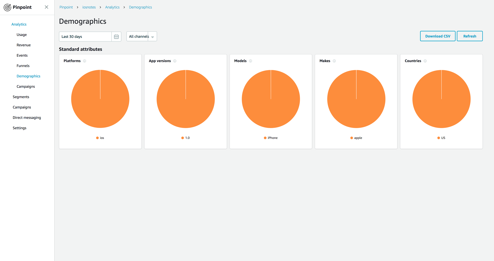

# Add Analytics to the Notes App

In the [previous section](./index.md) of this tutorial, we installed Xcode, downloaded a sample note-taking app from GitHub, then compiled and ran it in the iOS Simulator. This tutorial assumes you have completed those steps. In this section, we  extend the notes app to include application analytics. Application analytics enable us to gather demographic information about the application usage.

You should be able to complete this section in 10-15 minutes.

## Create an AWS Backend

1. In a terminal window, enter the following commands to initialize your project using AWS Amplify:

    ```bash
    $ cd ~/aws-mobile-ios-notes-tutorial-master/
    $ amplify init
    ```
    
    The CLI prompts you through the process of initializing your backend project. Specify iOS for the app type when prompted.

2. Next, add the analytics service to your backend.

    ```bash
    $ amplify add analytics

    Again, the CLI prompts you through the process of initializing your backend project.

3. To deploy your backend AWS resources run the following:

    ```bash
    $ amplify push
    ```

The `amplify init` command does the following within your project:

*  Create a basic backend definition in the `amplify` directory.
*  Create an `awsconfiguration.json` file describing the backend in the `aws-mobile-ios-notes-tutorial-master` project directory.

The `amplify add analytics` command adds the appropriate entries into the backend definition file for deploying Amazon Pinpoint as a service for this project.  The `amplify push` command deploys any new services that are defined and updates the `awsconfiguration.json` file so that the new services can be used within your app.

## Add Analytics Dependencies

1. To create a `Podfile` for your project, run from within your project folder:

    ```bash
    $ pod init
    ```

2. Open `Podfile` and replace the placeholder code with the following. If the file is not visible your Xcode Project Navigator, right-click the project root and choose **Show in finder**.

    ```
    platform :ios, '9.0'
    target :'MyNotes' do
        use_frameworks!

        # Analytics dependency
        pod 'AWSPinpoint'

        # other pods
    end
    ```

3. Close your Xcode project and then run the following command from a terminal:

    ```bash
    $ pod install --repo-update
    ```

    If you encounter an error message that begins `[!] Failed to connect to GitHub to update the CocoaPods/Specs . . .`, and your internet connectivity is working, you may need to [update openssl and Ruby](https://stackoverflow.com/questions/38993527/cocoapods-failed-to-connect-to-github-to-update-the-cocoapods-specs-specs-repo/48962041#48962041>).

4. Launch the project in Xcode

    ```bash
    $ open MyNotes.xcworkspace
    ```
    
    > **Important**
    >
    > From this point forward, **open your project using the** `MyNotes.xcworkspace` **file** generated by cocoapods for all further development.

5. Rebuild your app after reopening it in the workspace to resolve APIs from new libraries called in your code. This is a good practice any time you add import statements to your projects.

## Add AWS Resource Configuration

The Amplify CLI creates and updates an AWS resources configuration `awsconfiguration.json` file for each configured feature. This file needs to be added to your Xcode project just once. The Amplify CLI keeps it in sync as you add features to your project.

1. In the Finder, navigate to the folder containing your app `.xcodeproj` file. From there, drag `awsconfiguration.json` to Xcode under the top Project Navigator folder (the folder name should match your Xcode project name).

2. In the **Options** dialog box that appears, clear the **Copy items if needed** check box. Choose **Create groups**, and then choose **Next**.

3. Choose **Finish**.

You have now created the AWS resources you need and connected them to your app.

## Create Analytics Service Class

The app contains a `protocol` definition called `AnalyticsService.swift` that defines how the app records analytics events.  There are analytics events generated throughout the app to show off what is happening.  The provided `LocalAnalyticsService.swift` implementation records those events to the debug log.  When you run the app, you will see the events within the debug log stream.

In this section, we will create a new provider that submits the recorded events to Amazon Pinpoint.  Start by creating an implementation of the `AnalyticsService`:

1. From the XCode project navigation, right-click the `MyNotes` folder (the same folder that contains the `AppDelegate.swift`) and choose **New File...**.
2. Ensure **Swift File** is highlighted, and then choose **Next**.
3. In **Save As**, enter `AWSAnalyticsService.swift`, and then choose **Create**.
4. In the `AWSAnalyticsService.swift` file that automatically opens, copy the following code:

    ```swift
    import Foundation
    import AWSCore
    import AWSPinpoint

    class AWSAnalyticsService : AnalyticsService {
        var pinpoint: AWSPinpoint?

        init() {
            let config = AWSPinpointConfiguration.defaultPinpointConfiguration(launchOptions: nil)
            pinpoint = AWSPinpoint(configuration: config)
        }

        func recordEvent(_ eventName: String, parameters: [String : String]?, metrics: [String : Double]?) {
            let event = pinpoint?.analyticsClient.createEvent(withEventType: eventName)
            if (parameters != nil) {
                for (key, value) in parameters! {
                    event?.addAttribute(value, forKey: key)
                }
            }
            if (metrics != nil) {
                for (key, value) in metrics! {
                    event?.addMetric(NSNumber(value: value), forKey: key)
                }
            }
            pinpoint?.analyticsClient.record(event!)
            pinpoint?.analyticsClient.submitEvents()
        }
    }
    ```


## Initialize the AWS Analytics Service in the AppDelegate

Now that we have an appropriate implementation of the `AnalyticsService` protocol that writes to Amazon Pinpoint, we need to tell the app to use it.  This is done within the `AppDelegate.swift`. Search for the `LocalAnalyticsService()` initializer and replace it as follows:

```swift
// Initialize the analytics service
// analyticsService = LocalAnalyticsService()
analyticsService = AWSAnalyticsService()
```

Your app is set up to provide session and demographic analytics automatically when launched.

## Run the Project and Validate Results

Run the application in the simulator. The app should work exactly as before but now the app is generating analytics traffic that can be shown in the Amazon Pinpoint console.

To view the demographics and session events, run the following command:

```bash
$ amplify console analytics
```

Note that it can take up to 5 minutes for the first data to be shown in the graphs.  You should see an uptick in several graphs:


Choose **Demographics** to view the demographics information.



If you see data within each page, you have successfully added analytics to your app. Should you release your app, you can come back here to see more details about your users.

## Next Steps

*  Continue the tutorial by adding [Authentication](./auth.md).
*  Learn more about [Amazon Pinpoint](https://aws.amazon.com/pinpoint/).
