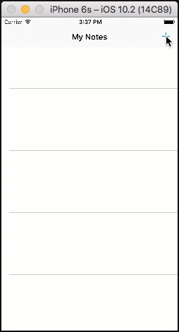

# Add Authentication to the Notes App

In the [previous section](./analytics.md) of this tutorial, we created a mobile backend project using the AWS Amplify CLI, and then added analytics to the sample note-taking app. This section assumes you have completed those steps. If you jumped to this step, please go back and [start from the beginning](./index.md). In this tutorial, we configure a sign-up / sign-in flow in our mobile backend. We then add a new authentication activity to our note-taking app.

You should be able to complete this section of the tutorial in 15-20 minutes.

## Set Up Your Backend

Before we work on the client-side code, we need to add user sign-in to the backend project.  These steps assume you have already completed the [analytics](./analytics.md) portion of this tutorial.

1. In a terminal window, enter the following commands to add user sign-in to the backend project:

    ```bash
    $ amplify update auth
    ```

   When prompted, use the default configuration.

2. Deploy your new resources with the following command:

    ```bash
    $ amplify push
    ```

The `amplify update auth` command updates the existing Amazon Cognito user pool configured for analytics, allowing for username and password authentication with email verification of the sign-up and forgot password flows.  You can adjust this to include multi-factor authentication, TOTP, phone number sign-up and more.

## Add Auth Dependencies

1. Add the following Auth dependencies in your project's `Podfile`:

    ```
    platform :ios, '9.0'
    target :'MyNotes' do
        use_frameworks!

        # Analytics dependency
        pod 'AWSPinpoint'

        # Auth dependencies
        pod 'AWSUserPoolsSignIn'
        pod 'AWSAuthUI'
        pod 'AWSMobileClient'

        # other pods
    end
    ```

    Then, in a terminal run the following:

    ```bash
    $ pod install
    ```

## Initialize an AWSMobileClient

Edit the `AppDelegate.swift` class.  Add the following to the imports:

```swift
import UIKit

// Auth imports
import AWSMobileClient
```

Add the following function to the `AppDelegate.swift` class:

```swift
func application(_ application: UIApplication, open url: URL,
        sourceApplication: String?, annotation: Any) -> Bool {

    return AWSMobileClient.sharedInstance().interceptApplication(
        application, open: url,
        sourceApplication: sourceApplication,
        annotation: annotation)
}
```

Initialize `AWSMobileClient` in the `didFinishLaunching` method of the `AppDelegate.swift` class.

```swift

func application(
    _ application: UIApplication,
    didFinishLaunchingWithOptions launchOptions:
    [UIApplicationLaunchOptionsKey: Any]?) -> Bool {

    // Other didFinishLaunching code . . .

    /* begin copying code here */
    // Initialize AWSMobileClient
    _ = AWSMobileClient.sharedInstance()
            .interceptApplication(application, didFinishLaunchingWithOptions:launchOptions)
    /* end copying code here */

    return true
}
```

## Implement Your Sign-in UI

The AWS Mobile SDK provides a library that creates a customizable sign-in UI in your app. To create your sign-in UI, add the following imports and then call the library in the `viewDidLoad()` function of the `MasterViewController.swift`:

```swift
/* begin copying code here */
import UIKit
import AWSAuthCore
import AWSAuthUI
/* stop copying code here */

class MasterViewController: UITableViewController {

    // . . .

    override func viewDidLoad() {
        super.viewDidLoad()
        self.title = "My Notes"

        /* begin copying code here */
        // Get a reference to the analytics service from the AppDelegate
        analyticsService = (UIApplication.shared.delegate as! AppDelegate).analyticsService

        // Get a reference to the data service from the AppDelegate
        dataService = (UIApplication.shared.delegate as! AppDelegate).dataService

        // Instantiate sign-in UI from the SDK library
        if !AWSSignInManager.sharedInstance().isLoggedIn {
            AWSAuthUIViewController.presentViewController(
                with: self.navigationController!,
                configuration: nil,
                completionHandler: { (provider: AWSSignInProvider, error: Error?) in
                    if error != nil {
                        self.analyticsService?.recordEvent("_userauth.auth_fail",
                            parameters: ["message":String(describing:error)], metrics: nil)
                    } else {
                        self.analyticsService?.recordEvent("_userauth.sign_in",
                            parameters: ["userid":AWSIdentityManager.default().identityId!], metrics: nil)
                    }
                }
            )
        }

        /* end copying code here */

        // Other viewDidLoad() code . . .
    }
}
```

The event names used for recording authentication events are specific and drive graphs within the Amazon Pinpoint console.  With these analytics events, you can see authentication failure rates and sign-in rates.

## Run the App and Validate Results

Build and run the project in a simulator. In the sign-in screen, choose **Create new account**.  After you submit the information, you receive a confirmation code via email. Enter the confirmation code to complete registration, and then sign in with your new account.


> **Tip**
>
> If you do not want to use your own email account as a test account, create an [Amazon WorkMail](https://aws.amazon.com/workmail/) service within AWS for test accounts. You can get started for free with a 30-day trial for up to 25 accounts.



## Next Steps

*  Continue by adding a [Serverless Backend](./data.md).
*  Learn more about [Amazon Cognito](https://aws.amazon.com/cognito/).
