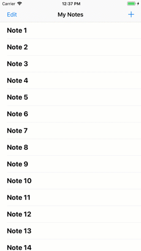

# Tutorial: Create a Simple iOS Note-Taking App

Start with a working app and then add cloud enable features. In this tutorial, you take a working app, driven from locally stored data, and then do the following:

* [Add analytics to your app](./analytics.md), so you can view demographic information about your users.
* [Add a simple sign-in/sign-up flow](./auth.md) for authentication.
* [Access data stores in the AWS cloud](./data.md), so that a users' notes are available to them on any device with the app installed.



You should be able to complete the setup section of this tutorial within 10-15 minutes after you have installed all required software. Once you complete the instructions on this page, you can run the project on your local system.

## Getting Started

Before beginning, you must:

1. Complete the [Getting Started](https://aws-amplify.github.io/media/get_started) instructions to install the Amplify CLI.
2. Install [Xcode](https://itunes.apple.com/us/app/xcode/id497799835?mt=12) using the Mac App Store (version 9.0 or higher is required).
3. Configure the Xcode command line tools. Run `xcode-select --install` from a Terminal window.
4. Install [Cocoapods](https://cocoapods.org/). From a terminal window run the following:

    ```bash
    $ sudo gem install cocoapods
    ```

## Download the Source Code

Download the [source code](https://github.com/aws-samples/aws-mobile-ios-notes-tutorial/archive/master.zip) from the GitHub repository.

## Compile and Run the Project

To compile the source code and run the project in a simulator:

1.  Unzip `aws-mobile-ios-notes-tutorial-master.zip` and launch Xcode by choosing `MyNotes.xcodeproj` in the expanded folder.
2.  Choose **Product** > **Build** (&#8984;-B) to build the project.
3.  In the toolbar next to the label with your app name, choose any compatible simulator from the list.
4.  On the top left choose the run icon (<span style="color: green;">&#9658;</span>) or type &#8984;-R to build and run the app.

You should be able to interact with the application. Try clicking on the **+** at the top right to create a note, or choose a note to show the editor screen.


Next Steps
----------

Next, [integrate application analytics](./analytics.md) into your project.

